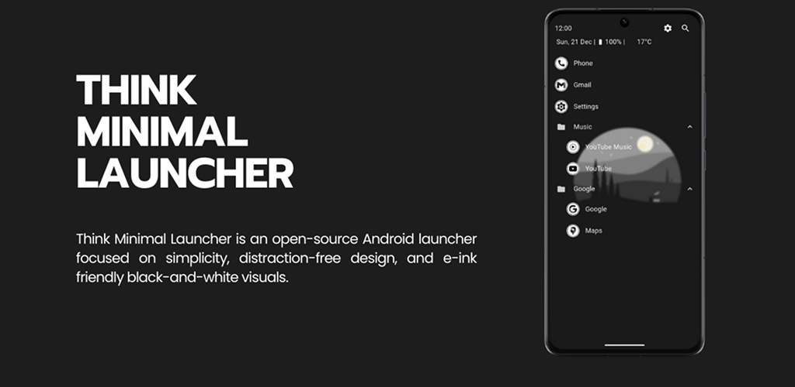
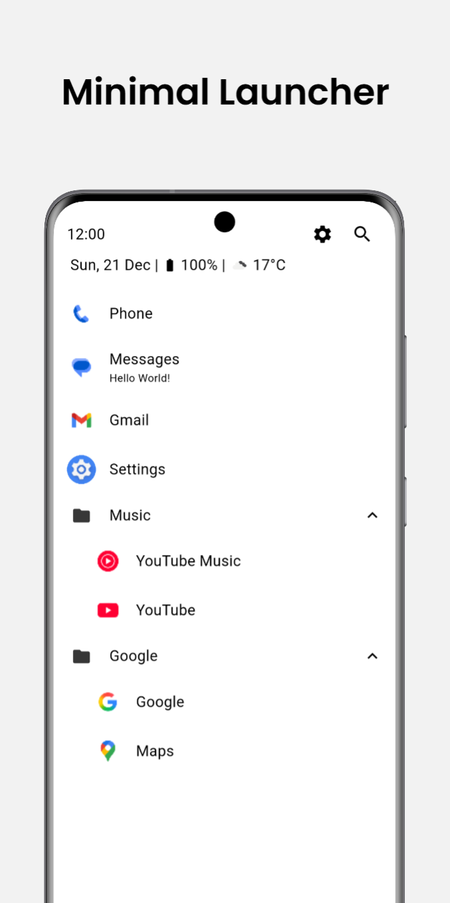
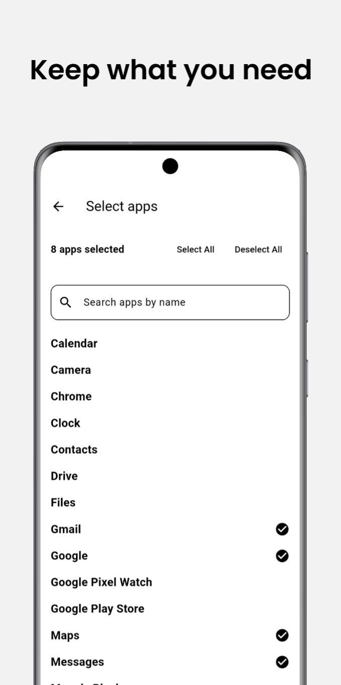
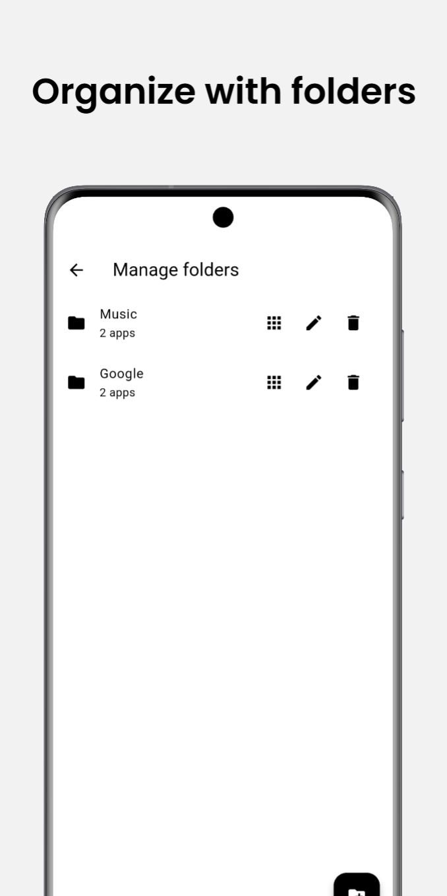
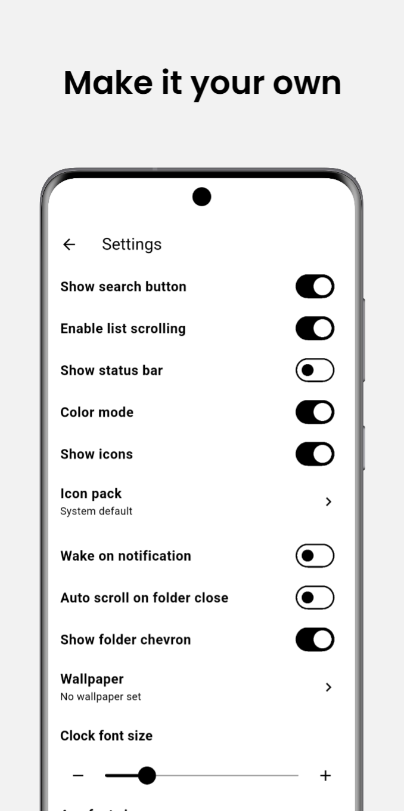
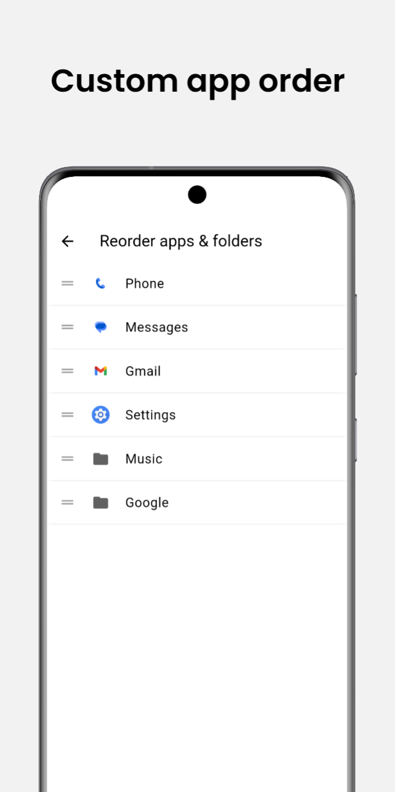

# Think Launcher 📱

  

## Technologies ⚙️

- Flutter

## Features 📲

- 📱 Select apps only that you need in custom order
- 👁️ E-ink & OLED Friendly user interface
- ✏️ Rename apps to custom display names
- 🔔 Recent notifications are shown under app name.
- 🔍 Search feature to quickly open apps you need.
- ☀️ Weather support with custom OpenWeather API Key
- 🌟 Third party theme support
- 🌄 Wallpaper with blur support
- 📂 Organize apps into folders
- 💾 Backup & restore settings
- ⚙️ Granular customizable preferences
- 🌞 Wake screen on new notification
- 🔐 No personal data is collected.
- 🌍 Full support for English and Dutch languages.

## Screenshots 📷

  
  
  
  
  
  

## Bugs and ideas 💡
Feel free to open issues or suggestions in the repository.

## License 📄

This project is licensed under the **MIT License**. You are free to use, modify, and distribute it, including for commercial purposes, as long as proper credit is given. [View full license](./LICENSE)

## Fork 🍽️
[MatiasDesuu/ThinkLauncher](https://github.com/MatiasDesuu/ThinkLauncher)
