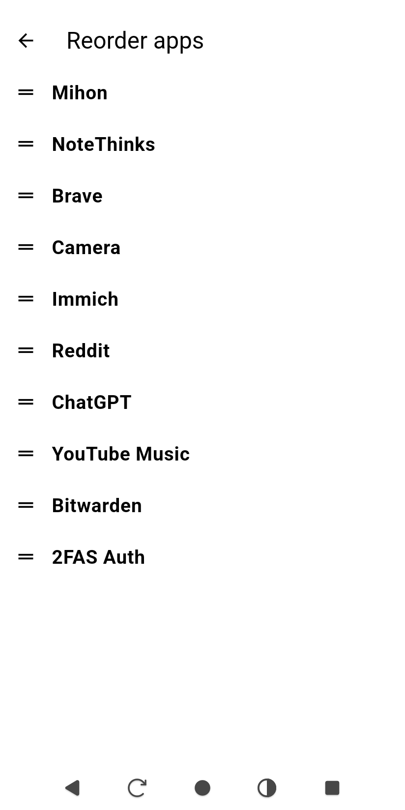

# InkLauncher

**InkLauncher** is a minimalist Android launcher designed specifically for **e-ink devices**. It prioritizes **simplicity**, **customization**, and uses only pure black and white tones and no animations.

## Screenshots

  
  
    
  

## ✨ Features

- 📱 **Home Screen App List**
  - Display installed apps with **only names**, **only icons**, or both.
  - Choose between a **scrollable** or **static** list.
  - Support for **1 to 4 columns** layout.
  - Customize the **font size**, **icon size**, and **text weight** (normal or bold).
  - Sort and select which apps to display.

- 🔍 **Search**
  - Quickly search for any installed app and launch it.

- ⚙️ **Configurable UI Elements**
  - Show or hide:
    - 🔧 Settings button
    - 🔎 Search button
    - 🕒 Time, date, and battery info.
    - 🔔 Status bar

- ✒️ **Optimized for e-ink**
  - Zero animations.
  - Pure black text on white background.
  - Minimal screen redraw to reduce ghosting and save battery.
  - Battery info updates every 5 minutes.

- 💡 **Bugs and ideas**
  - Feel free to open issues or suggestions in the repository.

## 📄 License

This project is licensed under the **MIT License**.  
You are free to use, modify, and distribute it, including for commercial purposes, as long as proper credit is given.

[View full license](./LICENSE)