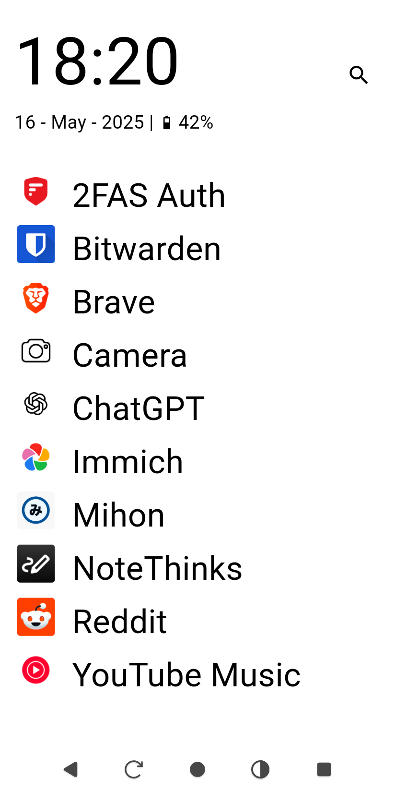
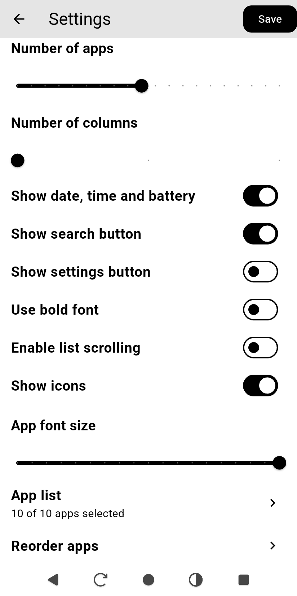
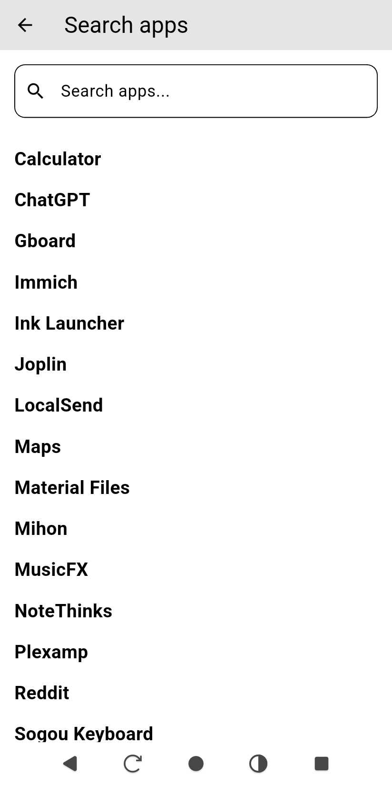
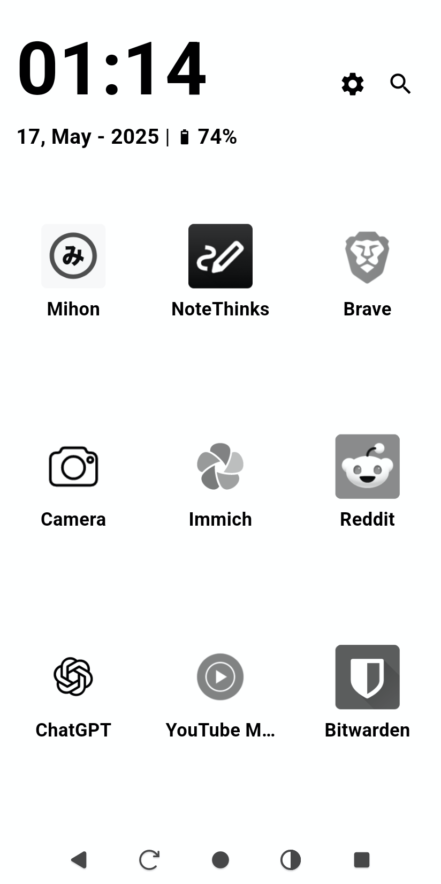

# InkLauncher

**InkLauncher** is a minimalist Android launcher designed specifically for **e-ink devices**. It prioritizes **simplicity**, **customization options**, and uses only pure black and white tones and no animations.

## Screenshots

  
  
  
  

## ✨ Features

- 📱 **Home Screen App List**
  - Display installed apps with **only names** (icons optional).
  - Option to make the list **scrollable** or static.
  - Support for **1 to 3 columns** layout.
  - Choose how many apps to show on the main screen.
  - Customize **font size** of app names.
  - Sort and select which apps to display.

- 🔍 **Search**
  - Quickly search for any installed app and launch it.

- ⚙️ **Configurable UI Elements**
  - Show or hide:
    - 🔧 Settings button
    - 🔎 Search button
    - 🕒 Time, date, and battery info.

- 🧠 **Built for e-ink**
  - No animations.
  - Black text, white background only.
  - Minimal redraw and screen refresh to preserve screen and battery.

- 💡 **Bugs and ideas**
  - Feel free to report any bug or suggest ideas.

## License

This project is licensed under the **Creative Commons Attribution-NonCommercial 4.0 International (CC BY-NC 4.0)** license.

You are free to use, modify, and share this code **as long as it is not for commercial purposes** and you give appropriate credit.

🔗 [Read full license here](https://creativecommons.org/licenses/by-nc/4.0/)
