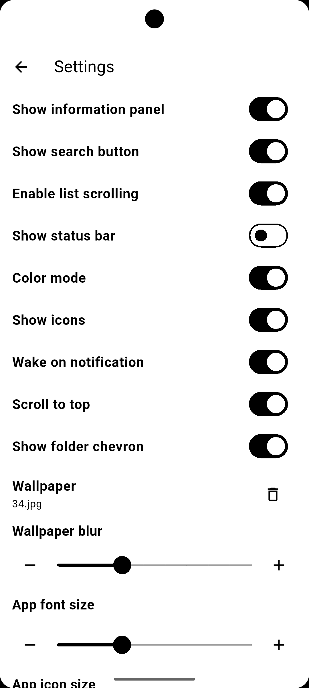

  

## Think Launcher 📱

**Think Launcher** is a minimalist Android launcher designed specifically for **e-ink devices**. It prioritizes **simplicity**, **customization**, and uses only pure black and white tones and no animations.

## Fork Changes 🍴

- Feat: Changed date format
- Feat: Added internalization support (English, Dutch)
- Feat: Added icon for app list
- Feat: Added notification support in app list
- Feat: Added folder support
- Feat: Weather support with custom app to launch support
- Feat: Removed app grid, bold font & long press gesture support
- Feat: Remove app limit
- Feat: Automatic Save feature after changes in settings
- Feat: Added Clear selected gesture app button
- Feat: App & Folder long press dialog options
- Feat: App & Folder reorder support
- Feat: Wallpaper with customizable blur support
- Feat: App alignment options
- Feat: Custom third party icon support
- Bug: Fixed for uninstalled apps

## Screenshots 📷

  
  
  
  
  
  
  
  

## Features ✨

- **Internationalization** 🌍

  - Full support for English and Dutch languages.

- **Home Screen App List** 📱

  - Display installed apps with only names, only icons, or both.
  - Choose between a scrollable or static list.
  - Customize font size, icon size, and text weight (normal or bold).
  - Select and sort which apps to display.
  - Icon support for app list.
  - Notification support directly in the app list.
  - Folder support for organizing apps.
  - Long tap for app & folder options.

- **Search** 🔍

  - Quickly search and launch any installed app.

- **Configurable UI Elements** ⚙️

  - Show or hide:
    - Search button
    - Time, date, and battery info
    - Status bar

- **Optimized for e-ink** ✒️

  - Zero animations.
  - Pure black text on white background.
  - Minimal screen redraw to reduce ghosting and save battery.
  - Battery info updates every 5 minutes.

- **Bugs and ideas** 💡
  - Feel free to open issues or suggestions in the repository.

## License 📄

This project is licensed under the **MIT License**.
You are free to use, modify, and distribute it, including for commercial purposes, as long as proper credit is given.

[View full license](./LICENSE)

## Fork 🍽️
[MatiasDesuu/ThinkLauncher](https://github.com/MatiasDesuu/ThinkLauncher)
